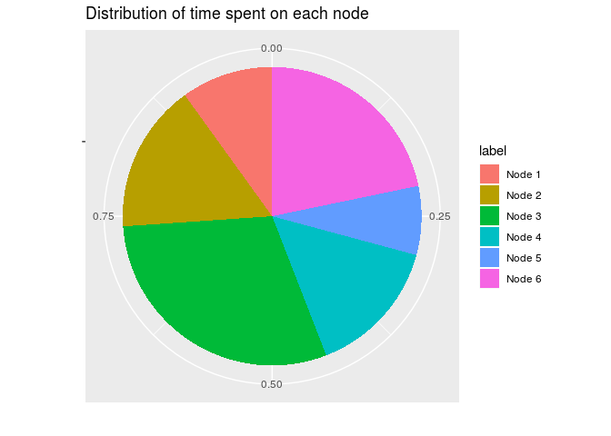

Homework 06 (stat 547a)
================

``` r
library(tidyverse)
```

    ## Warning: replacing previous import by 'tibble::as_tibble' when loading
    ## 'broom'

    ## Warning: replacing previous import by 'tibble::tibble' when loading 'broom'

    ## ── Attaching packages ───────────────────────────────────────────────────────────────────────────────────────────────────── tidyverse 1.2.1 ──

    ## ✔ ggplot2 3.0.0     ✔ purrr   0.2.5
    ## ✔ tibble  1.4.2     ✔ dplyr   0.7.6
    ## ✔ tidyr   0.8.1     ✔ stringr 1.3.1
    ## ✔ readr   1.1.1     ✔ forcats 0.3.0

    ## ── Conflicts ──────────────────────────────────────────────────────────────────────────────────────────────────────── tidyverse_conflicts() ──
    ## ✖ dplyr::filter() masks stats::filter()
    ## ✖ dplyr::lag()    masks stats::lag()

The tasks I chose are

1.  Character Data
2.  Writing your own function

Task 1: Character Data
----------------------

TBD

Task 2: Writing your own function
---------------------------------

For this task my choice is to implement `pagerank` algorithm. Pagerank is used in directed graphical models to rank the importance of nodes. Specifically, it is applied in web search by google to rank web pages by order of importance.

``` r
## Pagerank algorithm
# returns a vector of the rank of each page 
pagerank <- function(A, tol = 1e-8) {
  n <- nrow(A);
  d <- rep(1/n, n);
  err <- Inf;
  while (err > tol) {
    d_next <- A %*% d;
    err <- norm(d_next - d);
    d <- d_next;
  }
  r <- n - rank(d) + 1;
  return(c(r,d));
}
```

Now, let's try the algorithm on a toy example network:

``` r
A = matrix(c(0, 1/2, 0, 1/2, 0, 0,
             0, 0, 1/2, 0, 0, 1/2, 
             1/3, 0, 0, 1/3, 0, 1/3,
             0, 1/2, 0, 0, 1/2, 0, 
             0, 1/2, 0, 0, 0, 1/2, 
             0, 0, 1, 0, 0, 0), nrow = 6);
x = pagerank(A);
n = length(x);
m = n/2;
label = paste('Node',1:m);
ranks = x[1:m]
probs = x[(m+1):(2*m)]
df = data.frame(label, probs, ranks)
```

Now let's try visualizing the graph:

``` r
ggplot(df, aes(x="",y=probs, fill=label)) + 
  geom_bar(width = 1,stat = 'identity') + 
  coord_polar('y', start = 0) + 
  ggtitle('Distribution of time spent on each node') + 
  xlab('') +
  ylab('') 
```



We can put this code into another function:

``` r
plot_distribution = function(A) {
  x = pagerank(A);
  n = length(x);
  m = n/2;
  label = paste('Node',1:m);
  ranks = x[1:m]
  probs = x[(m+1):(2*m)]
  df = data.frame(label, probs, ranks)
  
  ggplot(df, aes(x="",y=probs, fill=label)) + 
    geom_bar(width = 1,stat = 'identity') + 
    coord_polar('y', start = 0) + 
    ggtitle('Distribution of time spent on each node') + 
    xlab('') +
    ylab('') 
}
```

Then, we can re-run the code with just with the matrix as input:

``` r
plot_distribution(A)
```


